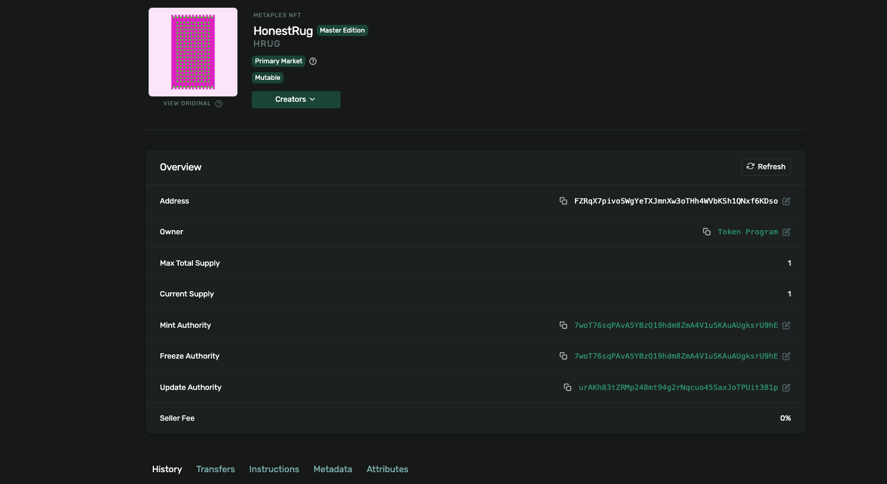

# NFT minting scripts (cluster1)

Simple pipeline to mint an NFT on Solana devnet using Metaplex UMI and Irys for uploads.

## Scripts

### `nft_image.ts`

Uploads the NFT image to Arweave. It:

1. Loads the image file (`generug.png` at repo root in `ts/`)
2. Wraps it as a UMI generic file with `Content-Type: image/png`
3. Uploads it via `umi.uploader.upload()` and prints the **image URI**

Run first; use the returned URI in `nft_metadata.ts`.

### `nft_metadata.ts`

Uploads the **NFT metadata JSON** to Arweave. It:

1. Builds a Metaplex-compliant metadata object (name, symbol, description, image URI, attributes, properties, creators)
2. Uploads it with `umi.uploader.uploadJson()`
3. Prints the **metadata URI**

Use this URI in `nft_mint.ts` when creating the NFT.

### `nft_mint.ts`

Mints the NFT on Solana devnet. It:

1. Creates a new mint keypair with `generateSigner(umi)`
2. Calls `createNft()` with name, symbol, metadata URI and 0% royalty
3. Sends the transaction on devnet and prints the Explorer link and mint address

Run after you have the metadata URI from `nft_metadata.ts`.

## Order to run

1. `nft_image.ts` → get image URI  
2. `nft_metadata.ts` → set image URI in metadata, get metadata URI  
3. `nft_mint.ts` → set metadata URI, then run to mint  

## Mint transaction

**Transactions (devnet):**

- **Mint:** [Explorer](https://explorer.solana.com/tx/5gsA3ewcZqdzj6fFDjF747J5odHvauAEM5XpjnYw2oqGfjB5Xf83wvYh3dDkhQj6cMxuhWiTVKPKN6yfJGSrqQV7?cluster=devnet)
- **Transfer:** [Explorer](https://explorer.solana.com/tx/5YfRQmuKZSLXMRXLr5Q65HTFHZbksU4KShp7a3iBBg8VZkFvDgogAeyswtnUAnWYjbsNVSfPQ5Yta7FCKHGBx5JD?cluster=devnet&customUrl=http%3A%2F%2F127.0.0.1%3A8899)

**Reflections about trading NFTs this way**

Each NFT we mint here as a Max Total Supply of 1. It is not really made for trading as liquidity is very low. 
If we want to trade it, we would need to make a lot of different pictures manually and regroup them inside a collection.
Furthermore, when we transfer the NFT we need to make a complex transaction that cost more than a basic transfer. In my example, it cost 0.002 SOL.

To make our NFT more tradable, we could use the Candy Machine of Metaplex that would allow to create a structure loaded by creators (multiple pictures, maybe randomly generated with a similar pattern) and then minted by buyers.

